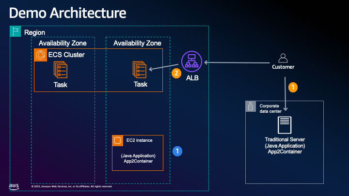

# Modernize Java Application with App2Containter




## Deploying with CloudFormation to EC2 instance

1. **Package the Java application**:

   ```bash
   mvn clean package
   ```

   This will create a WAR file in the `target` directory.

   **Or Using IntelliJ IDEA:**
   - Build the WAR file using IntelliJ:
   - Go to the "Maven" tool window (usually on the right side)
   - Expand your project's lifecycle folder
   - Double-click on "clean"
   - Then double-click on "package"
   - Your WAR file will be created in the target directory

2. **Upload the CloudFormation template**:
   - Log in to the AWS Management Console
   - Navigate to CloudFormation
   - Click "Create stack" > "With new resources (standard)"
   - Upload the `cloudformation-template.yaml` file
   - Follow the wizard to complete the stack creation:
     - Provide a stack name
     - Select an existing EC2 key pair for SSH access
     - Set a secure MySQL root password
     - Choose an instance type (t2.micro is fine for testing)

3. **Deploy the Java application**:
   After the stack is created (check the Outputs tab for the instance URL):

   ```bash
   scp -i your-key.pem target/masterclassdemo-1.0-SNAPSHOT.war ec2-user@your-instance-public-dns:/tmp/
   ssh -i your-key.pem ec2-user@your-instance-public-dns
   sudo cp /tmp/masterclassdemo-1.0-SNAPSHOT.war /opt/tomcat/webapps/masterclassdemo.war
   ```

4. **Access your application**:
   Open a browser and navigate to:

   ```bash
   http://your-instance-public-dns:8080/masterclassdemo/
   ```

## Configuration Notes

1. **Database Connection**:
   Update the `DatabaseConnection.java` file to use the correct MySQL connection details:

   ```java
   private static final String URL = "jdbc:mysql://localhost:3306/masterclassdb";
   private static final String USER = "root";
   private static final String PASSWORD = "your-mysql-password";
   ```

   Then rebuild and redeploy the application.

2. **Security Considerations**:
   - The template opens ports 22 (SSH), 80 (HTTP), 443 (HTTPS), and 8080 (Tomcat)
   - For production, consider restricting SSH access to specific IP ranges
   - Consider setting up HTTPS with a certificate
   - Use a more secure password storage mechanism (e.g., hashing)

3. **Troubleshooting**

- Check Tomcat logs if you encounter issues:

  ```bash
  tail -f /opt/tomcat/logs/catalina.out
  ```

---

## AWS App2Container Instruction


1. **Setup Prerequisites on the Java application Server**:

   - Install Docker Engine amd App2Container https://docs.aws.amazon.com/app2container/latest/UserGuide/start-intro.html

2. **Analyse**:

   ```bash
   [root@ip-172-31-0-54 ~]# sudo app2container analyze --application-id java-tomcat-2c086248
   ```

3. **To containerize the application on the application server**

   ```bash
   [root@ip-172-31-0-54 ~]# sudo app2container containerize --application-id java-tomcat-2c086248
   ```

4. **Deploy your application**

   ```bash
   [root@ip-172-31-0-54 ~]# sudo app2container generate app-deployment --application-id java-tomcat-2c086248

   or

   [root@ip-172-31-0-54 ~]# sudo app2container generate app-deployment --deploy --application-id java-tomcat-2c086248
   ```

Review the App deployed to Amazon ECS.
